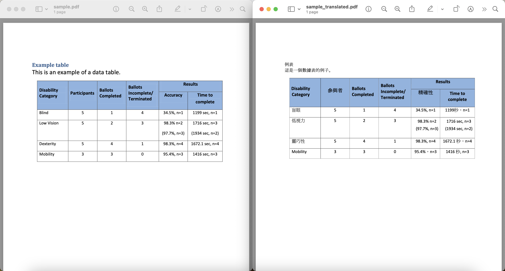
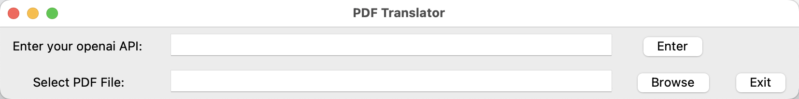

# PDF Translator

This Python script provides a graphical user interface (GUI) for translating PDF documents using OpenAI's API. It allows users to input their OpenAI API key, select a PDF file, translate it into Traditional Chinese, and view the translated document.

## Features

- Translate PDF documents from English to Traditional Chinese.
- Integrate with OpenAI's API for translation.
- Preserve the original formatting and structure of the document.

## Sample Result


## How to Use


1. **Set up OpenAI API Key**: Enter your OpenAI API key in the designated input field.
2. **Select PDF File**: Browse and select the PDF file you want to translate.
3. **View Translated Document**: Once the translation is completed, view the translated document.

## Dependencies

- Python 3.x
- tkinter (for GUI)
- pdf2docx (for converting PDF to DOCX)
- docx2pdf (for converting DOCX to PDF)
- openai (for translation)
- spire.doc (for additional document conversion)

## Usage

1. Clone this repository to your local machine.
2. Install the required dependencies using pip:

```bash
pip install -r requirements.txt
```

3. Run the script:

```bash
python3 pdf_translator.py
```

4. Follow the on-screen instructions to translate your PDF documents.

## Contributing

Contributions are welcome! If you find any issues or have suggestions for improvements, feel free to open an issue or submit a pull request.

## License

This project is licensed under the [MIT License](LICENSE).